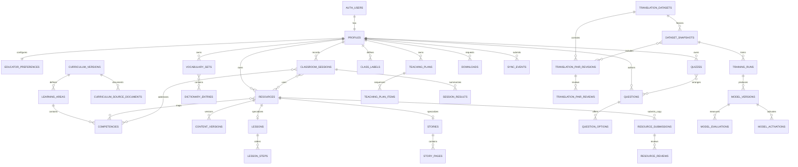

# Database relationship diagram

The diagram groups the main relationships; join and history tables preserve versions, reviews, and ownership.

```mermaid
erDiagram
  AUTH_USERS ||--|| PROFILES : has
  PROFILES ||--|| EDUCATOR_PREFERENCES : configures
  PROFILES ||--o{ RESOURCES : owns
  CURRICULUM_VERSIONS ||--o{ CURRICULUM_SOURCE_DOCUMENTS : documents
  CURRICULUM_VERSIONS ||--o{ LEARNING_AREAS : defines
  LEARNING_AREAS ||--o{ COMPETENCIES : contains
  RESOURCES ||--o{ CONTENT_VERSIONS : versions
  RESOURCES }o--o{ COMPETENCIES : maps
  RESOURCES ||--o| LESSONS : specializes
  LESSONS ||--o{ LESSON_STEPS : orders
  RESOURCES ||--o| STORIES : specializes
  STORIES ||--o{ STORY_PAGES : contains
  PROFILES ||--o{ VOCABULARY_SETS : owns
  VOCABULARY_SETS }o--o{ DICTIONARY_ENTRIES : contains
  PROFILES ||--o{ QUESTIONS : authors
  QUESTIONS ||--o{ QUESTION_OPTIONS : offers
  PROFILES ||--o{ QUIZZES : owns
  QUIZZES }o--o{ QUESTIONS : arranges
  PROFILES ||--o{ TEACHING_PLANS : owns
  TEACHING_PLANS ||--o{ TEACHING_PLAN_ITEMS : sequences
  PROFILES ||--o{ CLASS_LABELS : defines
  PROFILES ||--o{ CLASSROOM_SESSIONS : records
  CLASSROOM_SESSIONS ||--o{ SESSION_RESULTS : summarizes
  CLASSROOM_SESSIONS }o--o{ RESOURCES : uses
  CLASSROOM_SESSIONS }o--o{ COMPETENCIES : addresses
  PROFILES ||--o{ DOWNLOADS : requests
  PROFILES ||--o{ SYNC_EVENTS : submits
  RESOURCES ||--o{ RESOURCE_SUBMISSIONS : submits_copy
  RESOURCE_SUBMISSIONS ||--o{ RESOURCE_REVIEWS : reviews
  TRANSLATION_DATASETS ||--o{ TRANSLATION_PAIR_REVISIONS : contains
  TRANSLATION_PAIR_REVISIONS ||--o{ TRANSLATION_PAIR_REVIEWS : reviews
  TRANSLATION_DATASETS ||--o{ DATASET_SNAPSHOTS : freezes
  DATASET_SNAPSHOTS }o--o{ TRANSLATION_PAIR_REVISIONS : includes
  DATASET_SNAPSHOTS ||--o{ TRAINING_RUNS : trains
  TRAINING_RUNS ||--o{ MODEL_VERSIONS : produces
  MODEL_VERSIONS ||--o{ MODEL_EVALUATIONS : measures
  MODEL_VERSIONS ||--o{ MODEL_ACTIVATIONS : activates
```
